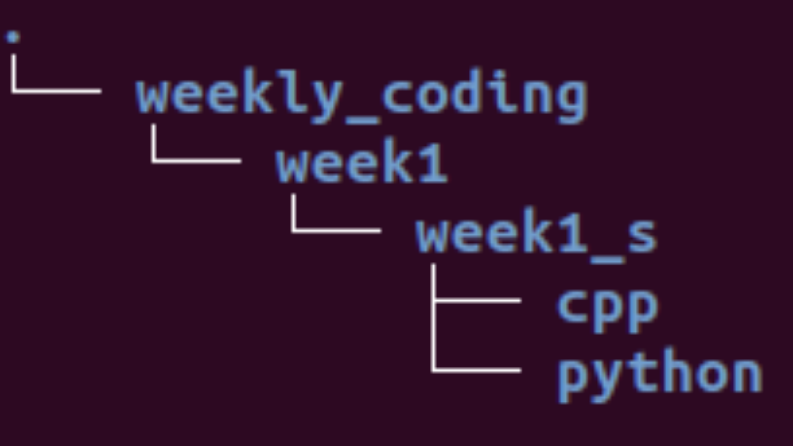

# Weekly_coding

This repository is meant for keeping all our work at one place and have it organized to share and compare our approaches.

# Structure

* For every person taking part in the meets we will have a dedicated branch(you can more branches from your base branch for your work)  on which we will work and push our work.

* For every meet we will consider having all the questions/problem statements in a folder named week#_q e.g. 'week1_q' and solutions in a different folder following the naing convention earlier seen e.g. 'week1_s'

* The solutions folder can further have separate sub folders based on the coding language you are using

* Here is an example of how it should look like

