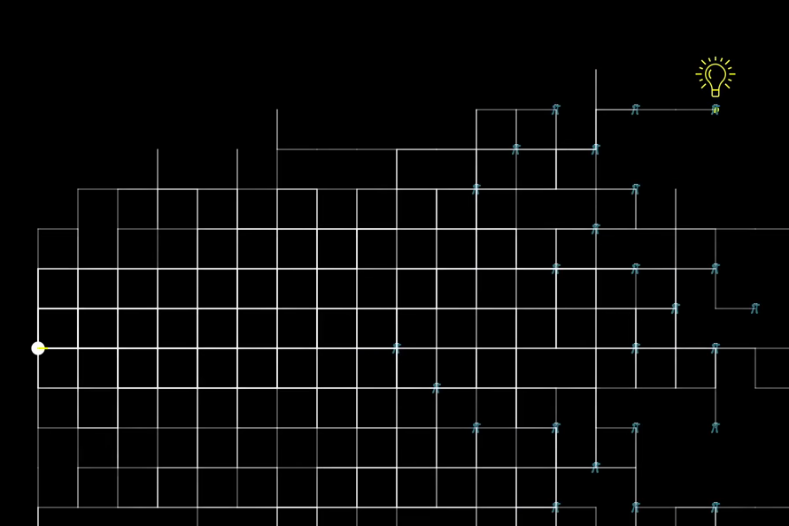

# Questions

1. Write a function that returns a **lambda expression**, which adds n to its input

    Example
    ```python
    adds1 = adds_n(1)
    
    adds1(3) ➞ 4
    adds1(5.7) ➞ 6.7
    
    adds10 = adds_n(10)
    
    adds10(44) ➞ 54
    adds10(20) ➞ 30
    ```
2. Write a Python program to reverse a string

    Example
    ```python
    Sample String : "1234abcd"
    Expected Output : "dcba4321"
    ```
3. Given a 3x3 matrix of a completed tic-tac-toe game, create a function that returns whether the game is a win for "X", "O", or a "Draw", where "X" and "O" represent themselves on the matrix, and "E" represents an empty spot.

    Example
    ```python
    tic_tac_toe([
      ["X", "O", "X"],
      ["O", "X",  "O"],
      ["O", "X",  "X"]
    ]) ➞ "X"
    
    tic_tac_toe([
      ["O", "O", "O"],
      ["O", "X", "X"],
      ["E", "X", "X"]
    ]) ➞ "O"
    
    tic_tac_toe([
      ["X", "X", "O"],
      ["O", "O", "X"],
      ["X", "X", "O"]
    ]) ➞ "Draw"
    ```

4. A random walk in grid to find hidden treasure. Given that each movement is **UNITY** and the person searching can take either *left, right, straight or reverse* steps along the grid.
  - Randomly set one point in the grid and mark the place with a red '*' to indicate treasure position
  - Search for the treasure can be achieved by more than one person 
  - Stop the program execution once any of the person has reached the place where treasure was hidden
    Example
    